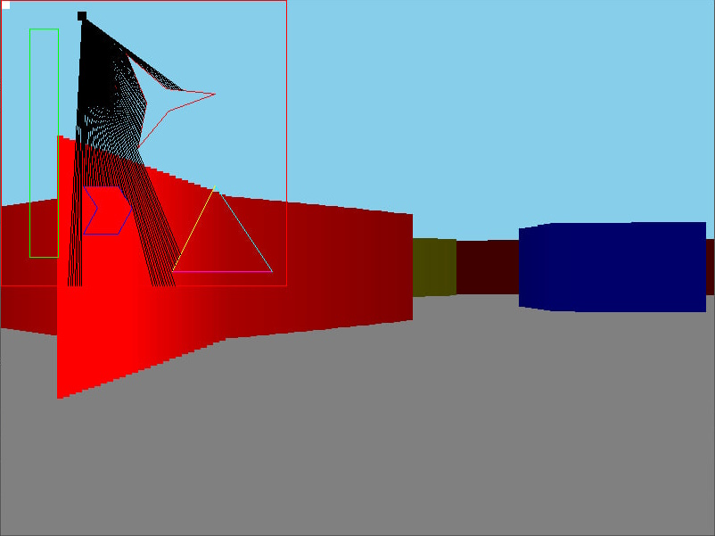

# Rust-raycaster

Небольшая попытка изучить Rust и базу фрейворка SDL на примере небольшого графического проекта. Имеюься два базовых варианта реализации рей-кастера на основе тайлмепы и множества двумерных отрезков.

Планировалось добавление загрузки текстур, однако, управление ресурсами Rust и SDL меня немного поддушило и я решил отложить данный аспект на будущее. Пока что мой опыт в управлении лайфтаймами слишком низок, чтобы сделать подобную схему :)

## Tilemap-based

Рейкастер, базирующийся на обычной тайлмепке.

Текущая реализация не использует **Quad-tree** для разбиения пространства и сжатия данных

## Linemap-based

Linemap - вероятно, не лучшее название, но отлично описывающее задание карты с помощью множества отрезков.

Текущая реализация не использует **BSP-tree** или, хотя бы **Quad-tree**, для оптимизации поиска пересечений луча камеры с отрезками на карте. Увы :с

### Используемый алгоритм рейкастинга

Так как при расчетах используются только двумерные отрезки, то и все расчеты луча происходят исключительно в двумерном пространстве. Вероятно, рейкастер, работающий в трехмерном пространстве, я сделаю позже :)

Имеется некоторый луч $r = (r_{s}, r_{e}, \alpha, d, d_{max})$, где $p_{s}$ и $p_{e}$ - начало и конец луча соответственно; $\alpha$ - угол, под которым был проброшен луч, относительно оси абсцисс; $d$ и $d_{max}$ - пройденная лучом дистанция и максимально возможная дистация луча соответственно, при чем $d = |\overrightarrow{r_{s}r_{e}}|; d < d_{max}$. Данные, хранимые в картеже луча, избыточны и используются исключительно для ускорения работы алгоритма, так как используется во множестве мест.

Пусть $L$ - множество всех отрезков на карте. Каждый отрезок $l = (l_{k}, l_{b}, p_{s}, p_{e})$ задается с помощью двух параметров - углового коэффициэнта $k$ и некоторой константы $b$, что дает представление отрезка в виде функции $y = kx + b$; $p_{s} и p_{e}$ - точки начала и конца отрезка соответственно. Необходимо найти такой отрезок $l_{min}$ пересекающийся с лучом $r$, что длина луча $r$, начинающегося в точке $r_{s}$ до точки пересечения с отрезком $l_{min}$ будет наименьшей. То есть первый отрезок, с которым пересечется прошенный луч.

Для дальнейших вычислений луч $r$ необходимо представить в виде отрезка $r_l$. Отрезок вычисляется по следующим формулам:

$r_{l_s} = r_s$

$r_{l_{e_x}} = r_{s_x} + r_{d_{max}} * cos(r_\alpha)$

$r_{l_{e_y}} = r_{s_y} + r_{d_{max}} * sin(r_\alpha)$

$r_{l_k} = \frac{r_{s_y} - r_{e_y}} {r_{s_x} - r_{e_x}}$

$r_{l_k} = r_{s_y} - r_k * r_{s_x}$

Если отрезок парралелен оси ординат, то есть $r_{s_x} - r_{e_x} = 0$, то $r_{l_k} = 0; r_{l_b} = r_{s_y}$

---

Для нахождения первого отрезка, с которым пересекается луч, необходимо решить задачу нахождения точки пересечения двух **прямых** $p_{i}$. Рассмотрим следующий алгоритм поиска пересечений двух прямых $l_{1}$ и $l_{2}$:

Если $l_{1_k}$ = $l_{2_k}$ то прямые парралельны друг-другу и они не пересекаются друг с другом.

Если отрезок $l_{1}$ парралелен оси ординат, то точка пересечения прямых $p_{i} = (p_{1_{s_x}}, l_{2}(p_{1_{s_x}}))$.

Если отрезок $l_{2}$ парралелен оси ординат, то точка пересечения прямых $p_{i} = (p_{2_{s_x}}, l_{1}(p_{2_{s_x}}))$.

То есть, если один из отрезков парралелен оси ординат, то точка пересечения будет просто равна точке, в которой второй отрезок принимает значение y парралельного прямой.

В ином случае прямые пересекаются в точке с координатами $p_{i_x} = \frac{l_{2_b} - l_{1_b}} {l_{1_k} - l_{2_k}}$, $p_{i_y} = l_{1}(p_{i_x})$. Формула, вычисляющая значение компонета x точки пересечения выводится из системы уравнений обоих прямых относительно x.

После нахождения точки пересечения **прямых** необходимо проверить, что найденная точка не выходит за границы каждого из двух отрезков. Если точка пересечения удовлетворяет условиям, то точка считается точкой пересечения **отрезков**.

---

Так как структура данных множества всех отрезков карты $L$ не оптимизирует поиск данных в пространстве, так как является простым массивом, необходимо перебирать все отрезки, присутствующие на карте. Для этого вычисляется точка пересечения отрезков с минимальным расстоянием от точки $r_s$ до точки $p_i$.

## Сборка

Необходимо установить в систему native библиотеки [rust-SDL](https://github.com/Rust-SDL2/rust-sdl2/tree/master) и [SDL-image](https://github.com/libsdl-org/SDL_image).

Для сборки проекта:

```bash
cargo update
cargo build
```

В проекте используется **динамическая** линковка SDL! После сборки проекта под ОС Windows необходимо добавить DLL файлы SDL и SDL-image в папку с проектом или иное место, где он сможет их подтянуть при запуске.

## Скриншоты


